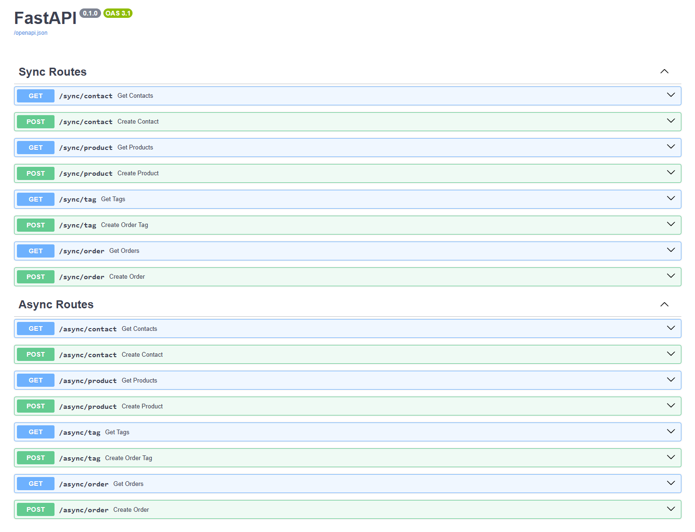

# FastAPI SQLModel Sync & Async Example

This project demonstrates how to use FastAPI and SQLModel to read and create data from or on a PostgreSQL database using both **synchronous** and **asynchronous** endpoints. The goal is to showcase how you can achieve similar results with `def async my_method()` and `def my_method()`, highlighting the differences in each approach.

This is intended as a reference project and hands-on guide, but it is not production-ready. It uses Docker, allowing you to clone the repository, run `docker-compose up`, and start testing immediately.

## Project description

For this project we are creating Sale Orders and we follow this simple approach:
* Every sale order will have a `name` and a `contact_id`
* Products to sell are grouped by `order_lines`.
* On every line we have a `product_id`, a `quantity` and a `price`
* Based on the lines, there is a field to compute the `amount total` in the sale order, considering the quantity and the price on every line.
* Every sale order can have none, one or more Tags. e.g: IT, First Aid, etc.

One example of sale order might look like this:
```json
{
    "id": 1,
    "name": "SO001",
    "contact_id": 2,
    "order_lines": [
      {
        "product_id": 1,
        "quantity": 1,
        "price": 0.25
      },
      {
        "product_id": 2,
        "quantity": 2,
        "price": 1.25
      }
    ],
    "tags": [
      {
        "name": "shopping"
      },
      {
        "name": "food"
      }
    ],
    "amount_total": 2.75
}
```

## Installation and initial setup

Clone this repo:
```bash
git clone https://github.com/rejamen/fastapi_sqlmodel_sync_async_example.git
```

Create a `.env` file with the following information (change it later if you want)
```
DB_HOST=db
DB_PORT=5432
DB_NAME=fastapi
DB_USER=postgres
DB_PASSWORD=postgres
```

Start the application using docker compose
```
docker compose up
```

If you did not have any error, which I hope yo didn't 🙂, you should have 2 Docker containers running one for **fastapi** and the other for **postgress** 
```
> docker ps

CONTAINER ID   IMAGE                       COMMAND                  CREATED        STATUS          PORTS                                       NAMES
ffba812cbd83   fastapi_async_example-web   "uvicorn app.main:ap…"   5 hours ago    Up 31 minutes   0.0.0.0:8000->8000/tcp, :::8000->8000/tcp   fastapi_async_example-web-1
84cc1c2c5262   postgres:15                 "docker-entrypoint.s…"   13 hours ago   Up 31 minutes   0.0.0.0:5432->5432/tcp, :::5432->5432/tcp   fastapi_async_example-db-1

```

## Testing FastAPI endpoints

Now, you can test the endpoints using the interactive API documentation provided by FastAPI on http://localhost:8000/docs




Routes are grouped in **Sync Routes** and **Async Routes**. No matter which one you test, both of the same type will achieve the same. I mean: `GET /sync/contact` and `GET /async/contact` will both list the existing contatcts in the Postgres database 🤓 

## Project structure

| File Name                | Description                                                                |
|--------------------------|----------------------------------------------------------------------------|
| `app/main.py`            | Entry point for the FastAPI application. Includes routes.                  |
| `app/models.py`          | Contains SQLModel models for the database tables.                          |
| `app/database.py`        | Handles database connection and session management.                        |
| `app/sync_routes.py`     | Defines synchronous endpoints for the application.                         |
| `app/async_routes.py`    | Defines asynchronous endpoints for the application.                        |
| `app/settings.py`        | Loads environment config using a Pydantic settings class                   |
| `docker-compose.yml`     | Docker Compose configuration file to set up the application and database.  |
| `Dockerfile`             | Dockerfile to build the FastAPI application container.                     |
| `.env`                   | Environment variables for database configuration.                          |
| `README.md`              | Documentation for the project, including setup and usage instructions.     |
| `requirements.txt`       | Lists Python dependencies for the project.                                 |


## Understanding models.py

No matter which approach we follow to create and read, the models will not change. They define the database table representations and the data validation models used in this project.

You will find a pattern:
- Classes that inherits from **SQLModel** are used as data validation (same as we do with Pydantic BaseModel)
- Classes that inherit from those classes, with `table=True` and name `ClassNameDB` are the ones to be used when accessing to the database tables.

For example:

```python
from sqlmodel import SQLModel

class Contact(SQLModel):
    name: str
    email: str


class ContactDB(Contact, table=True):
    __tablename__ = "contact"
    
    id: Optional[int] = Field(default=None, primary_key=True)
```
will define a table in the database called **contact** with: `id`, `name` and `email`.

And something like:
```python
from fastapi import FastAPI

app = FastAPI()

@app.create_contact(contact: Contact):
    # your code
```
will validate the received data to have `name` and `email` both strings and required.

Another important aspect is the use of relationships in this project:
- **Order** has a `many-to-one` relationship with **Contact**
- **Order** has a `one-to-many` relationship with ***OrderLine*
- **Order** has a `many-to-many` relationship with **Tag**

As we are using SQLModel we use `Relationship` and `back_populates` as per [SQLModel documentation](https://sqlmodel.tiangolo.com/)

## Sync vs Async

Lets have a look to this code where we are creating a **Contact** in a `sync` way:

```python
# File: app/sync_main.py
from sqlmodel import Session
from app.database import engine

# some code here...

def get_session() -> Generator[Session, None, None]:
    with Session(engine) as session:
        yield session

@sync_router.post("/contact")
def create_contact(
    contact: Contact, 
    session: Session = Depends(get_session)
):
    try:
        contact_db = ContactDB(**contact.model_dump())
        session.add(contact_db)
        session.commit()
        session.refresh(contact_db)
        return contact_db
    except Exception as e:
        _logger.error(f"Error creating contact: {e}")
        raise HTTPException(status_code=500, detail=f"{e}")

# more code here...
```

versus how we do the same in `async` way:

```python
# File: app/async_main.py
from sqlalchemy.orm import sessionmaker
from sqlmodel.ext.asyncio.session import AsyncSession
from typing import List, AsyncGenerator
from app.database import async_engine

# some code here...

async_session = sessionmaker(
    async_engine, class_=AsyncSession, expire_on_commit=False
)

async def get_async_session() -> AsyncGenerator[AsyncSession, None]:
    async with async_session() as session:
        yield session

@async_router.post("/contact")
async def create_contact(
    contact: Contact,
    session: AsyncSession = Depends(get_async_session)
):
    try:
        contact_db = ContactDB(**contact.model_dump())
        session.add(contact_db)
        await session.commit()
        await session.refresh(contact_db)
        return contact_db
    except Exception as e:
        _logger.error(f"Error creating contact: {e}")
        raise HTTPException(status_code=500, detail=f"{e}")

# more code here...
```

The first difference to notice is how the `session` is created:
- For **sync** is simpler: using the `engine` imported from app/database.py (more on that later)
- For **async** needs more work: using the `session_maker` from sqlalchemy.orm, an `async_engine` imported from app/database.py (more details later), `AsyncSession` and `AsyncGenerator`

As mentioned before, the way the `engine` is created also changes:
- Sync engine requires `create_engine` from  **sqlmodel** and `postgresql` driver in the url
- Async engine requires `create_async_engine` from **sqlalchemy.ext.asyncio** and `postgresql+asyncpg` driver in the url

```python
# File app/database.py
from sqlmodel import create_engine
from sqlalchemy.ext.asyncio import create_async_engine

# ...
DATABASE_URL = f"postgresql://{DB_USER}:{DB_PASSWORD}@{HOST}:{PORT}/{DB_NAME}"
ASYNC_DATABASE_URL = f"postgresql+asyncpg://{DB_USER}:{DB_PASSWORD}@{HOST}:{PORT}/{DB_NAME}"

engine = create_engine(DATABASE_URL, echo=False)
async_engine = create_async_engine(ASYNC_DATABASE_URL, echo=False)

# ...
```

Another key difference is how SQLAlchemy handles async operations—especially with relationship fields.
A common and frustrating error is:
```
greenlet_spawn has not been called; can't call await_only() here. Was IO attempted in an unexpected place? (Background on this error at: https://sqlalche.me/e/20/xd2s)"
```
This usually happens when trying to access lazy-loaded relationships outside an async context, or without using proper loading strategies like selectinload. SQLAlchemy's async layer doesn't support implicit lazy loading the same way as sync code does.

For example, this **sync** code will work, for reading orders with all relational fields
```python
# File: app/sync_main.py
@sync_router.get('/order', response_model=List[OrderRead])
def get_orders(session: Session = Depends(get_session)):
    try:
        query = select(OrderDB)
        orders = session.exec(query).all()
        for order in orders:
            # Force load the relationships SQLModel will handle
            # this automatically when returning
            order.order_lines
            order.tags
        return orders
    except Exception as e:
        _logger.error(f"Error fetching orders: {e}")
        raise HTTPException(status_code=500, detail=str(e))
```

but when you try to do something similar with **async**
```python
# File: app/async_main.py
@async_router.get('/order', response_model=List[OrderRead])
async def get_orders(session: AsyncSession = Depends(get_async_session)):
    try:
        query = select(OrderDB)
        result = await session.exec(query)
        orders = result.all()
        for order in orders:
            # Force load the relationships - SQLModel will handle this automatically when returning
            order.order_lines
            order.tags
        return orders
    except Exception as e:
        _logger.error(f"Error fetching orders: {e}")
        raise HTTPException(status_code=500, detail=str(e))
```

This piece of code will give you the error I mentioned before. And the key to fix it is adding options in the `seletc` like this corrected code:
```python
# ...
query = select(OrderDB).options(
    selectinload(OrderDB.order_lines),
    selectinload(OrderDB.tags),
)
# ...
```

The other more obvious difference are the use of `def my_method()` vs `async def my_method()` and the `await` instruction.

## Final words

With those points in mind, go now and test every endpoint, check the `app/sync_main.py` and `app/async_main.py` files, create `Contacts`, `Products`, `Tags`, etc. Explore `app/models.py` to see all the classes created and let me know opening issues if you found any error.

Big thanks to [**Sebastian Ramirez**](https://github.com/tiangolo), the creator of FastAPI and SQLModel for creating such amazing tools.